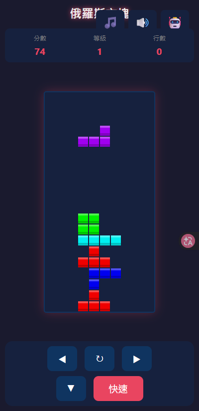

# 🎮 俄羅斯方塊 (Tetris)

[](https://deploy.workers.cloudflare.com/?repo=https://github.com/chiisen/Tetris)  
[](LICENSE)  
[](https://github.com/chiisen/Tetris/stargazers)  

✨ 經典俄羅斯方塊網頁版，支援電腦與手機同步暢玩！不論是休閒運動還是挑戰極限，都能在這裡找到樂趣。



🔗 **線上啟動遊戲**: [https://tetris.liawchiisen.workers.dev/](https://tetris.liawchiisen.workers.dev/)

---

## 📑 目錄

- [📖 遊戲介紹](#遊戲介紹)
- [🌟 功能特性](#功能特性)
- [🧱 方塊類型](#方塊類型)
- [📂 項目結構](#項目結構)
- [💻 本地開發](#本地開發)
- [🎮 操作方式](#操作方式)
- [🏆 計分規則](#計分規則)
- [📈 速度曲線](#速度曲線)
- [🛠️ 技術說明](#技術說明)
- [🌐 瀏覽器相容性](#瀏覽器相容性)
- [❓ 常見問題](#常見問題)
- [📝 更新日誌](#更新日誌)
- [🤝 貢獻指南](#貢獻指南)
- [⚖️ 許可證](#許可證)
- [👤 作者](#作者)

---

## 📖 遊戲介紹

俄羅斯方塊是一款風靡全球的經典方塊消除遊戲。玩家需要透過靈活移動、精準旋轉各種隨機落下的方塊，將它們拼湊成完整的橫線。每消除一行都能獲得分數並釋放空間，挑戰你的手速與空間邏輯！

## 🌟 功能特性

- 🕹️ **經典再現**：完美的俄羅斯方塊核心玩法。
- 🌈 **全型態方塊**：支援 7 種標準 SRS 形狀 (I, O, T, S, Z, J, L)。
- 🆙 **等級系統**：每消除 10 行即自動升級，挑戰更高難度。
- ⚡ **動態難度**：隨等級提升的方塊下落速度曲線。
- 📱 **全平台支援**：完美支援觸控操作（滑動 + 虛擬按鈕）與行動裝置優化。
- ⌨️ **流暢控制**：流暢的鍵盤操作響應。
- ⏸️ **隨性暫停**：隨時暫停/繼續，掌握遊戲節奏。
- 🎨 **響應式佈局**：RWD 設計，在各種螢幕螢幕尺寸下皆能展現最佳視覺效果。
- 🎵 **沈浸式體驗**：高品質音效 (Web Audio API) 與背景音樂，支援獨立開關。
- 🤖 **智慧 AI**：內建電腦代玩模式，觀察 AI 是如何挑戰高分的。

## 🧱 方塊類型

| 形狀 | 名稱 | 顏色 | 代表符號 |
|:---:|:---:|:---:|:---:|
| **I** | 長條 | 青色 | 🟦 |
| **O** | 方塊 | 黃色 | 🟨 |
| **T** | T 形 | 紫色 | 🟪 |
| **S** | S 形 | 綠色 | 🟩 |
| **Z** | Z 形 | 紅色 | 🟥 |
| **J** | J 形 | 藍色 | 🟦 |
| **L** | L 形 | 橘色 | 🟧 |

## 📂 項目結構

```
Tetris/
├── index.html      # 遊戲主頁面
├── game.js         # 核心遊戲邏輯
├── style.css       # 介面視覺樣式表
├── LICENSE         # MIT 許可證
└── wrangler.jsonc  # Cloudflare Workers 部署配置
```

## 💻 本地開發

### 🚩 前置需求

- 現代瀏覽器 (Chrome, Firefox, Safari, Edge)

### 🚀 執行方式

1. **複製專案到本地**：
   ```bash
   git clone https://github.com/chiisen/Tetris.git
   cd Tetris
   ```

2. **啟動遊戲**：
   直接使用瀏覽器開啟 `index.html` 即可開始遊玩！

### ☁️ 部署至 Cloudflare Workers (可選)

如果您希望線上運行自己的版本：
```bash
npx wrangler deploy
```

## 🎮 操作方式

### ⌨️ 電腦鍵盤

| 按鍵 | 功能說明 |
|:---:|---|
| **←** | 向左平移方塊 |
| **→** | 向右平移方塊 |
| **↓** | 加速下落 (軟降) |
| **↑ / 空格** | 順時針旋轉方塊 |
| **P** | 暫停遊戲 / 恢復遊戲 |

### 📱 手機觸控

- **滑動控制**：上下左右滑動，操作直覺靈活。
- **輕觸點擊**：點擊遊戲區域即可旋轉方塊。
- **虛擬操控**：螢幕底部配備實體感的方向鍵。

### ⚙️ 控制面板

點擊右上角按鈕可快速切換：
- 🎵 **背景音樂** (BGM ON/OFF)
- 🔊 **遊戲音效** (SFX ON/OFF)
- 🤖 **AI 代玩模式** (AI ON/OFF)

## 🏆 計分規則

| 消除行數 | 獲得分數 |
|:---:|---|
| 1 行 | 100 × 當前等級 |
| 2 行 | 300 × 當前等級 |
| 3 行 | 500 × 當前等級 |
| 4 行 | 800 × 當前等級 (Tetris!) |

- **成長機制**：每消除 10 行累計升一級。
- **難度遞增**：等級越高，方塊的重力感應就越強！

## 📈 速度曲線

| 等級 | 下落間隔時間 (ms) | 挑戰程度 |
|:---:|:---:|:---|
| 1 | 1000 | 開心遊玩 |
| 2 | 900 | |
| 3 | 800 | |
| 4 | 700 | 小試身手 |
| 5 | 600 | |
| 6 | 500 | |
| 7 | 400 | 高手對決 |
| 8 | 300 | |
| 9 | 200 | 極限生存 |
| 10+ | 100 | 神之領域 |

## 🛠️ 技術說明

- 🎨 **HTML5 Canvas**: 基於高速渲染的畫布技術。
- 📡 **Web Audio API**: 提供無延遲的動態音效回饋。
- 📱 **Mobile First**: 優先考慮觸控體驗與彈性佈局。
- ⚡ **Cloudflare Workers**: 高效、快速的全球 CDN 佈局服務。

## 🌐 瀏覽器相容性

| 瀏覽器 | 最低支援版本 | 推薦程度 |
|:---:|:---:|:---:|
| Chrome | 80+ | ⭐⭐⭐⭐⭐ |
| Firefox | 75+ | ⭐⭐⭐⭐⭐ |
| Safari | 13+ | ⭐⭐⭐⭐ |
| Edge | 80+ | ⭐⭐⭐⭐⭐ |

## ❓ 常見問題

### Q: 遊戲進度如何存檔？
A: 目前採用輕量化設計，遊戲資料即時存在記憶體中，重新整理頁面將重啟新局。

### Q: 支援離線遊玩嗎？
A: **支援！** 透過 Service Worker 技術，您只要在有網路時開啟過一次，後續即可在離線狀態下暢玩。

### Q: 發現 Bug 或想提供建議？
A: 非常歡迎！請前往 [GitHub Issues](https://github.com/chiisen/Tetris/issues) 分享您的想法。

## 📝 更新日誌

詳細的版本演進請參閱 [CHANGELOG.md](CHANGELOG.md)。

## 🤝 貢獻指南

我們非常歡迎開發者社群的參與！

1. Fork 本專案。
2. 建立專屬的功能分支 (`git checkout -b feature/AmazingFeature`)。
3. 提交您的精彩更動 (`git commit -m 'feat: Add some AmazingFeature'`)。
4. 將分支推送到 GitHub (`git push origin feature/AmazingFeature`)。
5. 發起一個 Pull Request。

## ⚖️ 許可證

本專案基於 **MIT 許可證** 開源 - 詳見 [LICENSE](LICENSE) 檔案。

## 👤 作者

**Eli** - [GitHub Profile](https://github.com/chiisen)

---
*Made with ❤️ by Eli*
